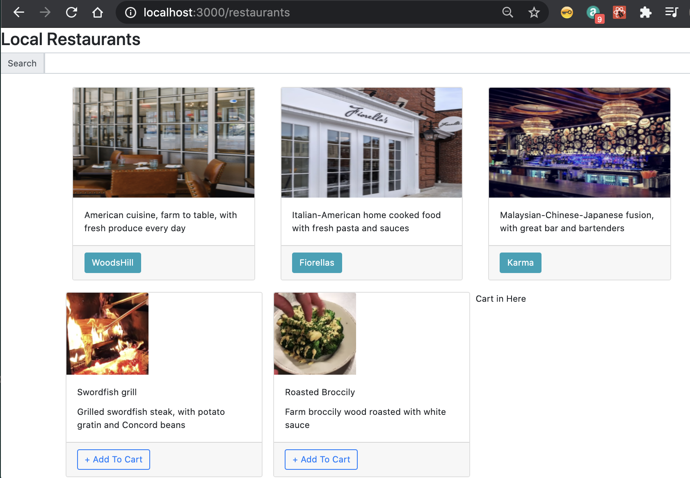

# MIT Fullstack Restaurant Application



## Starter Files Notes

### Frontend Notes

This is a [Next.js](https://nextjs.org/) project bootstrapped with [`create-next-app`](https://github.com/vercel/next.js/tree/canary/packages/create-next-app)

- index3.js (Data is hardcoded)
- index.js (Get data from Strapi using Apollo and GraphQL)
- restaurantList.js is Web Component to render restaurants

### Backend Notes

The backend is a strapi application. For detailed explanation on how things
work, checkout the [Strapi docs](https://docs-v3.strapi.io/developer-docs/latest/)

#### Permissions plugin configuration

For the **Public** role:

- Application
    - Resaurant
        - find
        - findone
    - Dish
        - find

For the **Authenticated** role:

- Application
    - Resaurant
        - find
        - findone
    - Dish
        - find
    - Order
        - create

## App Requirements

### Create account

- [x] User can create an account with email and password input field
- [x] User receives a success message after creating an account
- [x] After creating an account, username or email appears on the top right corner

### Login

- [x] User can log into account with email
- [x] User can log out of account
- [x] User can log in with another authentication source from OAuth 2 — Disccord
    account

### Homepage

- [x] Display list of restaurants

### Search Functionality

- [x] User can search for restaurants from home page
- [ ] User can search for dishes on restaurant page

### Cart Functionality

- [x] User can add dishes to cart. User can remove dishes from cart
- [x] Price updates automatically
- [x] User can update quantity in cart

### Checkout Functionality

- [ ] User can check out with Stripe
- [ ] User receives a success message
- [x] Input fields are validated

## Contributing

### Notes

- Do not use the useState hook to work with a single state object unless you're
    going to set the whole state only once per render. If for some reason you
    decide to create individual functions to update a single object, calling them
    in sequence will cause that only the last value is written to the state

    <details>
    <summary>Wrong Example</summary>
    <section>

    ```jsx
    // App.js

    import React, { useState } from 'React';
    import { AppContext } from './context.js';
    import Component1 from 'Component1.js'

    function App() {
        const [ state, setState() ] = useState({ key1: 1, key2: 2 });
        const setKey1 = ( key1 ) => setState( { ...state, key1 } );
        const setKey2 = ( key1 ) => setState( { ...state, key2 } );

        // ...

        return (
            <AppContext.Provider value={{
                key1: state.key1,
                setKey1,
                key2: state.key2,
                setKey2
            }}>
                <Component1 />
            </AppContext.Provider>
        )
    }

    export default App;

    ```

    ```jsx
    // Component1.js

    import React, { useState } from 'React';
    import { AppContext } from './context.js';

    function Component1(){
        const appContext = useContext( AppContext );

        // ...

        const handleClick = () => {
            appContext.setKey1( 2 );
            appContext.setKey2( 3 );
            // Expected new state: { key1: 2, key2: 3 }
            // Reality: { key1: 1, key2: 3 }
        }

        return (
            <button type="button" onClick={ handleClick }>Click me!</button>
        )
    }

    export default Component1;
    ```

    In the above example, the problem is that React does not update the values of
    the variable linked to the `setState` function immediately but until the JS
    stack is empty, which means that by the time the `setKey2`
    function is executed after the button is clicked, the state will continue to
    be the same and therefore only the value of key2 will be changed

    </section>
    </details>

    <details>
    <summary>Right Example</summary>
    <section>

    ```jsx
    // App.js

    import React, { useState } from 'React';
    import { AppContext } from './context.js';
    import Component1 from 'Component1.js'

    function App() {
        const [ key1, setKey1 ] = useState( 1 );
        const [ key2, setKey2 ] = useState( 2 );

        // ...

        return (
            <AppContext.Provider value={{
                key1,
                setKey1,
                key2,
                setKey2
            }}>
                <Component1 />
            </AppContext.Provider>
        )
    }

    export default App;

    ```

    ```jsx
    // Component1.js

    import React, { useState } from 'React';
    import { AppContext } from './context.js';

    function Component1(){
        const appContext = useContext( AppContext );

        // ...

        const handleClick = () => {
            appContext.setKey1( 2 );
            appContext.setKey2( 3 );
            // Expected new state: { key1: 2, key2: 3 }
            // Reality: { key1: 2, key2: 3 }
        }

        return (
            <button type="button" onClick={ handleClick }>Click me!</button>
        )
    }

    export default Component1;
    ```

    In the above example, since both variables are separated, each will get its
    own value as expected

    </section>
    </details>

### Prerequisites

1. Install homebrew on macOS
2. Install NVM

    ```bash
    curl -o- https://raw.githubusercontent.com/nvm-sh/nvm/v0.39.1/install.sh | bash
    ```

3. Install Node.js with NVM

    ```bash
    nvm install lts/erbium
    nvm use lts/erbium
    ```

4. Upgrade npm to npm 8

    ```bash
    npm install --global npm@8
    ```

5. Install yarn

    ```bash
    npm install --global yarn
    ```

### Run

Run locally by executing:

```bash
yarn
yarn dev
```

#### Running the Frontend

Run locally by executing:

```bash
yarn
yarn dev
```

Then, open [http://localhost:3000](http://localhost:3000) with your browser to
see the result

You can start editing the page by modifying `pages/index.js`. The page
auto-updates as you edit the file.

#### Running the Backend

Run locally by executing:

```bash
cd backend
yarn
yarn develop
```

### Deploy

The easiest way to deploy your Next.js app is to use the
[Vercel Platform](https://vercel.com/import?utm_medium=default-template&filter=next.js&utm_source=create-next-app&utm_campaign=create-next-app-readme)
from the creators of Next.js

Check out our [Next.js deployment documentation](https://nextjs.org/docs/deployment)
for more details

## Resources

- <https://docs-v3.strapi.io/developer-docs/latest/update-migration-guides/update-version.html#upgrading-the-dependencies>
- <https://github.com/strapi/strapi/issues/9145>
- <https://github.com/strapi/strapi/issues/10326>
- <https://docs-v3.strapi.io/developer-docs/latest/development/plugins/users-permissions.html#providers>

### Next.js

To learn more about Next.js, take a look at the following resources:

- [Next.js Documentation](https://nextjs.org/docs) - learn about Next.js
    features and API.
- [Learn Next.js](https://nextjs.org/learn) - an interactive Next.js tutorial.

You can check out
[the Next.js GitHub repository](https://github.com/vercel/next.js/) - your
feedback and contributions are welcome!
